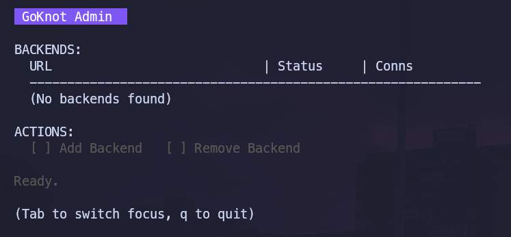
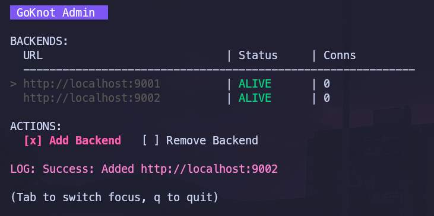
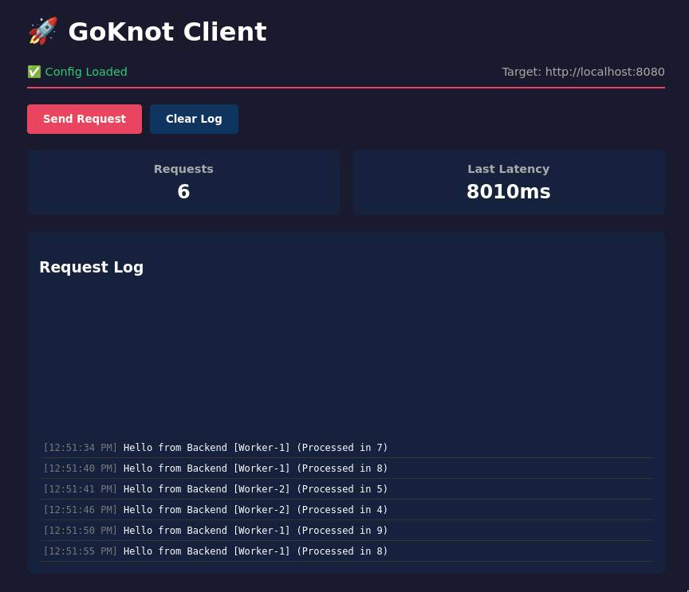

# GoKnot
A lightweight, reliable reverse proxy for tying your backend services together.

GoKnot distributes incoming traffic across multiple backend servers with configurable load balancing strategies, automatic health checking, and a comprehensive management interface. Built with concurrency in mind, it leverages Go's goroutines for efficient health monitoring and request handling.

## Key Features

- **Multiple Load Balancing Strategies**: Round-robin and least-connections algorithms for optimal traffic distribution
- **Active Health Checking**: Continuous TCP-based health monitoring with configurable intervals
- **RESTful Admin API**: Dynamically add, remove, and monitor backends without downtime
- **Terminal UI (TUI)**: Interactive terminal interface for visual backend management
- **Configuration Management**: JSON-based configuration with runtime override capabilities
- **Docker-Ready**: Includes containerized dummy backends for testing

## Architecture Overview

GoKnot operates as a reverse proxy layer between clients and backend servers. Upon startup, it loads configuration from `config.json`, initializes the backend pool, and spawns dedicated goroutines for health checking. Incoming requests are routed through the proxy handler, which selects an available backend based on the configured strategy. The admin API runs on a separate port, allowing operational control without interfering with proxy traffic.

The health checker maintains backend availability state by periodically attempting TCP connections. Failed backends are automatically marked as not alive and excluded from load balancing rotation until they recover.

## Getting Started

### Prerequisites

- Go 1.25 or higher
- Docker (optional, for running test backends)
- npx or Python3 (optional, for running the client)

### Installation

Clone the repository and build the binary:

```bash
git clone https://github.com/ibhiyassine/GoKnot.git
cd GoKnot
go build -o GoKnot
```

### Quick Start

1. Configure your reverse proxy by editing `config.json`:

```json
{
    "port": 8080,
    "strategy": "round_robin",
    "health_check_frequency": "15s",
    "admin": 3333
}
```

2. Start the reverse proxy:

```bash
./GoKnot
```

You will be welcomed with a nice TUI:



## Configuration

The `config.json` file accepts the following parameters:

| Parameter                | Type    | Description                                                  | Default     |
| ------------------------ | ------- | ------------------------------------------------------------ | ----------- |
| `port`                   | integer | Port for the reverse proxy to listen on                      | 8080        |
| `strategy`               | string  | Load balancing strategy: `round_robin` or `least_connections` | round_robin |
| `health_check_frequency` | string  | Interval between health checks (e.g., "10s", "1m")           | 15s         |
| `admin`                  | integer | Port for the admin API server                                | 3333        |

Configuration is loaded at startup. To apply changes, restart the GoKnot service.

## Load Balancing Strategies

### Round Robin

Distributes requests sequentially across all healthy backends. Each backend receives an equal share of traffic over time. Best suited for homogeneous backend configurations where all servers have similar capacity.

### Least Connections

Routes requests to the backend with the fewest active connections. Ideal for scenarios with long-lived connections or variable request processing times. Ensures more even resource utilization across backends with different loads.

## Admin API Reference

Although a dedicated TUI runs at startup to minimize the headache of writing requests. It is nice to mention them for anyone who is not willing to use the TUI and wants another interface to work with.y

The admin API runs on the port specified in the configuration (default: 3333).

### Add Backend

```http
POST /backends
Content-Type: application/json

{
  "url": "http://backend-server:port"
}
```

Adds a new backend to the load balancing pool. The backend is immediately included in health checks.

### Remove Backend

```http
DELETE /backends
Content-Type: application/json

{
  "url": "http://backend-server:port"
}
```

Removes a backend from the pool. Active connections are not terminated.

### Get Status

```http
GET /status
```

Returns the current state of all backends, including health status and connection counts.

Example response:

```json
{
    "backends":[
   	{
       "url":"http://localhost:9001",
       "alive":true,
       "current_connections":0
   },{
       "url":"http://localhost:9002",
       "alive":true,
       "current_connections":0
   }
],
 "total_backends":2
}
```

## Admin TUI

The TUI is launched upon startup with the reverse proxy.

```bash
./GoKnot
```

The TUI provides a visual interface for managing backends with the following capabilities:

- View real-time backend health status

- Add backends through an input form

- Remove backends with button controls

- Monitor active connections per backend

  

Navigate using arrow keys or vim motions, change focus between status and actions using the Tab key, and execute actions with Enter.

## Testing & Development

### Running Dummy Backends

GoKnot includes containerized dummy backends for testing load balancing behavior.

Build the dummy backend image:

```bash
cd dummy-backend
docker build -t goknot-dummy .
```

Run multiple backend instances:

```bash
docker run -d -p 9001:8080 -e SERVER_ID="backend-1" goknot-dummy
docker run -d -p 9002:8080 -e SERVER_ID="backend-2" goknot-dummy
docker run -d -p 9003:8080 -e SERVER_ID="backend-3" goknot-dummy
```

Add them to GoKnot:

```bash
curl -X POST http://localhost:3333/backends -d '{"url": "http://localhost:8001"}'
curl -X POST http://localhost:3333/backends -d '{"url": "http://localhost:2"}'
curl -X POST http://localhost:3333/backends -d '{"url": "http://localhost:8003"}'
```

Or through the **TUI**...

### Using the Test Client

A web-based client interface is included for interactive testing:

```bash
cd client
python3 -m http.server 8888
```

Open `http://localhost:8888` in your browser. The interface allows you to send requests through the reverse proxy and observe which backend handles each request. You can also run `npx serve .` if you don't want to use python.



## Project Structure

```
.
├── client/              # Web-based test client
├── dummy-backend/       # Dockerized test backends
├── internal/
│   ├── admin/          # Admin API implementation
│   ├── config/         # Configuration loader
│   ├── domain/         # Core domain models
│   ├── health/         # Health checking logic
│   ├── loadbalancer/   # Load balancing strategies and pool
│   ├── proxy/          # HTTP reverse proxy handler
│   └── tui/            # Terminal UI implementation
├── logs/               # Application logs
├── config.json         # Runtime configuration
└── main.go             # Application entry point
```

The codebase follows clean architecture principles with separation of concerns across packages. The `internal` directory contains all business logic, organized by functional domain.

## Roadmap and Security

We are currently tracking specific imporevements:

* [] **Authentication**: Restrict access to the Admin API.
* [] **Backend Locking**: Ensure backends only accept requests from GoKnot.
* [] **Persistence**: Save backends state to disk to survive restart

## License

MIT License - see LICENSE file for details.
